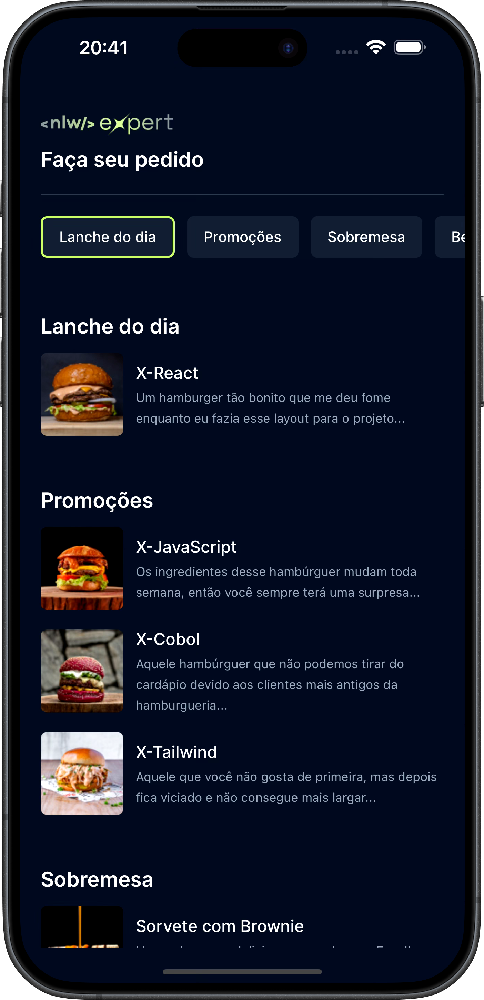

<style>

input{
display: none;
}

label{
color: #3355FF;
cursor: pointer;
}

.center{
text-align: center;
}

.container{
width: 100%;
/*background-color: #333;*/
}

.summary{
display: flex;
flex-direction: row;
width: 100%;
/*background-color: #222;*/
}

#pt-br-btn:checked ~ .container .pt-br {
display: block;
}
#pt-br-btn:checked ~ .container .us-en {
display: none;
}
#pt-br-btn:checked ~ .container .dev-info-br {
display: block;
}
#pt-br-btn:checked ~ .container .dev-info-us {
display: none;
}

#us-en-btn:checked ~ .container .pt-br {
display: none;
}
#us-en-btn:checked ~ .container .us-en {
display: block;
}
#us-en-btn:checked ~ .container .dev-info-br {
display: none;
}
#us-en-btn:checked ~ .container .dev-info-us {
display: block;
}

</style>

<input type="radio" id="pt-br-btn" name="lang" checked>
<input type="radio" id="us-en-btn" name="lang">

<!-- CONTAINER -->
<div class="container">

<h1>ORDERS APP</h1>


<h3 style="text-align: center">
<label for="pt-br-btn">
Ler em [PT-BR]
</label>
||
<label for="us-en-btn">
Read in [US-EN]
</label>
</h3>
<hr>
<!-- SUMMARY DIV -->
<div class="summary">

<!-- CONTENT DIV PT-BR -->
<div class="pt-br" style="flex: 1; padding-right: 1rem">
<h2>Resumo</h2>
<hr>
<p style="text-align: justify">
App de lanches no estilo Ifood onde é possível escolher
no cardápio e enviar o pedido por whatsapp. Inclui
carrinho de compras, possibilitando revisar o pedido,
excluir e adicionar itens.
</p>
<h2>Características</h2>
<hr>
<ul>
<li><b>Interface Elaborada</b> com foco na Experiência
do Usuário.</li>
<li><b>Carrinho de Compras</b> para gerenciamento dos
pedidos.</li>
<li><b>Envio de Dados</b> do pedido por WhatsApp.</li>
</ul>
<h2>Como Funciona</h2>
<hr>
<p style="text-align: justify">
O usuário acessa o aplicativo, selciona seus pedidos
no menu interativo e os adiciona em seu carrinho de
compras.
Quando estiver finalizado o pedido, o usuário pode
finalizá-lo clicando em "enviar pedido" e informar
o endereço de entrega, o que o levará ao aplicativo
de mensagens WhatsApp com o prompt do seu pedido
pronto para envio.
</p>
</div>
<!-- END CONTENT DIV PT-BR -->

<!-- CONTENT DIV US-EN -->
<div class="us-en" style="flex: 1; padding-right: 1rem">
<h2>Summary</h2>
<hr>
<p style="text-align: justify">
Ifood-style snack app where you can choose
from the menu and send the order via WhatsApp. Includes
shopping cart, allowing to review the order,
delete and add items.
</p>
<h2>Features</h2>
<hr>
<ul>
<li><b>Sophisticated Interface</b> focused on User
Experience.</li>
<li><b>Shopping Cart</b> for order management.</li>
<li><b>Data Sending</b> of the order via WhatsApp.</li>
</ul>
<h2>How It Works</h2>
<hr>
<p style="text-align: justify">
The user accesses the app, selects their orders
from the interactive menu and adds them to their shopping
cart.
When the order is complete, the user can
finalize it by clicking on "send order" and entering
the delivery address, which will take them to the messaging
app WhatsApp with the prompt of their order
ready to be sent.
</p>
</div>
<!-- END CONTENT DIV US-EN  -->

<!-- IMG DIV  -->
<div style="width: 300px; padding-top: 2rem">
</img>
</div>
<!-- END IMG DIV  -->

</div>
<!-- END OF SUMMARY DIV -->

<!-- DEV INFO -->
<div class="dev-info-br">
<h1>Pré-requisitos</h1><hr>
Antes de iniciar, certifique-se de ter instalado em sua máquina:
<ul>
<li>Node.js (Versão 20.11 ou superior)</li>
<li>NPM ou Yarn</li>
</ul>
<h2>Configuração Local</h2><hr>
Para configurar este projeto localmente, siga estas etapas:
<ol>
<li>Clone o repositório:</li>

```bash
git clone https://github.com/victorpowilleit/nlw-expert-order.git
```
<li>Navegue até a pasta do repositório:</li>

```bash
cd nlw-expert-order
```
<li>Instale as dependências:</li>

```bash
npm install
```
</ol>
<h2>Rodando o Projeto</h2><hr>
<ol>
<li>Inicie a emulação do projeto:</li>

```bash
npm run start --clear
```
<li>Escolha o sistema de testes (iOS / Android) ou aponte
a câmera do seu celular para o QR Code para
rodar o projeto localmente.</li>

</ol>
<h1>Como Contribuir</h1>
Contribuições são sempre bem-vindas!
Seja adicionando novas funcionalidades, corrigindo bugs ou melhorando a documentação.

Para contribuir:
- Faça um **fork** do projeto.
- Crie uma **nova branch** para sua contribuição
- Envie para a branch `git push origin feature/nova-funcionalidade`.
- Abra um **Pull Request**.

Feito por [Victor Powilleit](https://github.com/victorpowilleit) no evento NLW.
</div>
<!-- END OF DEV INFO -->

<!-- DEV INFO EN_US -->
<div class="dev-info-us">
<h1>Prerequisites</h1><hr>
Before starting, make sure you have installed on your machine:
<ul>
<li>Node.js (Version 20.11 or higher)</li>
<li>NPM ou Yarn</li>
</ul>
<h2>Local Setup</h2><hr>
To set up this project locally, follow these steps:
<ol>
<li>Clone the repository:</li>

```bash
git clone https://github.com/victorpowilleit/nlw-expert-order.git
```
<li>Navigate to the repository folder::</li>

```bash
cd nlw-expert-order
```
<li>Install the dependencies:</li>

```bash
npm install
```
</ol>
<h2>Running the Project</h2><hr>
<ol>
<li>Start project emulation:</li>

```bash
npm run start --clear
```
<li>Choose your testing system (iOS / Android) or point your
smartphone camera to the QR Code that will show up to run
the project on your physical device.</li>

</ol>
<h1>How to Contribute</h1>
Contributions are always welcome!
Whether adding new features, fixing bugs, or improving documentation.

To contribute:

- Make a **fork** of the project.
- Create a **new branch** for your contribution.
- Push to the branch `git push origin feature/new-feature`.
- Open a **Pull Request**.

Created by [Victor Powilleit](https://github.com/victorpowilleit) at the NLW event.
</div>
<!-- END OF DEV INFO -->

<!-- END OF CONTAINER -->
</div>